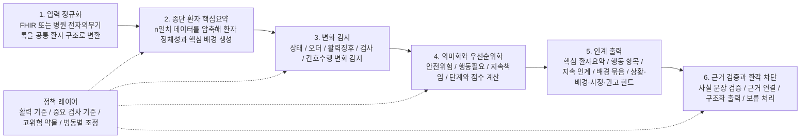

# 간호 인계 알고리즘 구조 문서

## 핵심 메시지

이 프로토타입의 중심은 `최근 변화 나열`이 아니라 `n일치 환자 정보를 사람처럼 압축 요약하는 것`이다.

가장 중요한 목표는 다음과 같다.

`핵심 환자요약만 읽어도 이 환자가 어떤 환자인지, 무엇을 특히 봐야 하는지, 다음 근무조가 무엇을 이어받아야 하는지를 파악할 수 있어야 한다.`

## 수정된 6단계 구조

## 왜 2단계 종단 환자 핵심요약이 가장 중요한가

간호사 인계는 원래 사람이 n일치 환자정보를 읽고, 그중 꼭 필요한 부분만 압축해 다음 사람에게 전달하는 과정이었다.

따라서 알고리즘도 먼저 다음 질문에 답해야 한다.

- 이 환자는 왜 입원했는가
- 지금 어떤 관리 틀 안에 있는가
- 지금까지 어떤 문제가 지속되고 있는가
- 오늘 변화가 없어도 꼭 봐야 하는 것은 무엇인가
- 아직 끝나지 않아 다음 근무조가 이어받아야 하는 것은 무엇인가

즉, 변화 감지보다 먼저 `이 환자의 핵심 배경을 압축하는 엔진`이 필요하다.

## 2단계 핵심요약 엔진이 남겨야 하는 5개 블록

### 1. 환자 정체성

- 입원 이유
- 주진단
- 중요한 과거력

### 2. 현재 관리 틀

- 산소치료
- line 또는 tube 또는 drain
- 격리
- 활동 수준
- 식이
- 낙상 또는 욕창 위험

### 3. 지속 중인 핵심 문제

- 여러 날 반복되거나 아직 해결되지 않은 문제
- 통증, 감염, 호흡, 순환, 배설, 정신상태, 수면, 영양 등

### 4. 꼭 봐야 할 배경

- 반복 이상 활력징후
- 반복 이상 검사 결과
- 자주 사용한 PRN
- 경과상 중요한 처치 흐름

### 5. 지속 인계 책임

- 미완료
- 보류
- 재확인 필요
- 추적 관찰 중인 업무

## 2단계 핵심요약 점수

핵심요약 엔진은 아래 점수로 `무엇을 상단 요약에 남길지` 결정한다.

`요약 중요도 점수 = 분류기본점수 + 지속성 + 현재행동필요도 + 안전위험도 + 간호의존도 + 반복성 - 해결감점`

### 점수 구성 예시

- 분류기본점수: 0~10점
- 지속성: 0~6점
- 현재행동필요도: 0~6점
- 안전위험도: 0~6점
- 간호의존도: 0~4점
- 반복성: 0~3점
- 해결감점: -6~0점

### 포함 기준 예시

- 26점 이상: 핵심 배경
- 18~25점: 집중 모니터링 배경
- 10~17점: 보조 배경
- 9점 이하: 상단 인계 제외

## 3단계 변화 감지

핵심요약 이후에만 변화 감지를 수행한다.

즉, 알고리즘은 단순히 어제와 오늘 값을 비교하는 것이 아니라,  
`이 환자가 어떤 환자인지`라는 배경 위에서 변화를 읽어야 한다.

감지 분류는 최소한 다음을 포함한다.

- 상태 변화
- 신규 오더
- 중단 오더
- 활력징후 변화
- 검사 결과 변화
- 간호수행 상태 변화

## 4단계 의미화와 우선순위화

우선순위는 점수만으로 정하지 않는다.

먼저 단계 승격 규칙을 적용하고, 그 다음 같은 단계 안에서 점수로 정렬한다.

### 단계 철학

- 0단계: 즉시 안전 위험 또는 긴급 대응
- 1단계: 다음 근무조의 시간 민감 행동
- 2단계: 후속 확인이 필요한 문제
- 3단계: 묶어서 전달 가능한 배경 정보

### 우선순위 점수 예시

`우선순위 지수 = 변화기본점수 + 즉시위험 + 시간민감 + 지속인계책임 + 보고필요 + 고위험맥락 + 최신성 - 근거부족감점`

## 5단계 인계 출력

최종 출력은 자유 문장 하나가 아니라 구조화된 인계 결과여야 한다.

최소 포함:

- 핵심 환자요약
- 우선순위 이벤트
- 행동 필요 항목
- 지속 인계 항목
- 묶음 배경 정보
- 설명 인덱스
- 상황·배경·사정·권고 힌트

## 6단계 근거 검증과 환각 차단

plain RAG 단독으로는 충분하지 않다.

권장 구조는 다음과 같다.

`근거 검색 + 사실 문장 분해 + 사실 문장과 근거 연결 + 재검토 루프 + 구조화 출력 + 근거 부족 시 생성 보류`

### 필요한 이유

- 인계는 환자 안전과 직접 연결된다
- 상위 우선순위 항목 하나의 환각도 위험하다
- 따라서 `모르면 말하지 않는 구조`가 필요하다

### 이 단계가 해야 하는 일

- 생성된 문장을 사실 단위 문장으로 분해
- 각 사실 문장에 근거 연결 강제
- 근거 부족 시 보정 검색 또는 규칙 기반 재검토
- 끝까지 증명되지 않으면 출력 보류
- 구조화 필드 우선 출력

### 출력 허용 기준 예시

- 0단계와 1단계 항목은 근거 연결률 100%
- 핵심 환자요약 사실 문장은 95% 이상 근거 연결
- 모순 0개
- 근거 없는 상위 항목 0개

## 간호사와 개발자에게 어떻게 설명할 것인가

### 간호사에게

- 이 알고리즘은 먼저 환자를 요약해서 “이 환자는 어떤 환자인가”를 잡는다
- 그다음 최근 변화와 남은 책임을 정리한다
- 따라서 최종 요약만 봐도 환자 파악이 가능해야 한다

### 개발자에게

- 입력 어댑터는 데이터 소스 의존 영역이다
- 핵심 엔진은 `정규화 -> 종단 요약 -> 변화 감지 -> 우선순위화 -> 구조화 출력 -> 검증`으로 나뉜다
- 정책 값은 설정 레이어로 분리해야 병원 이식성이 생긴다

## 최종 설계 규칙

사용자는 이 엔진을 다음 순서로 이해해야 한다.

1. 무엇을 입력으로 받는가
2. 어떻게 n일치 환자정보를 압축 요약하는가
3. 어떤 변화를 감지하는가
4. 어떤 기준과 점수로 우선순위를 매기는가
5. 어떤 구조의 인계 출력을 만드는가
6. 어떻게 환각을 줄이고 근거를 재검토하는가
